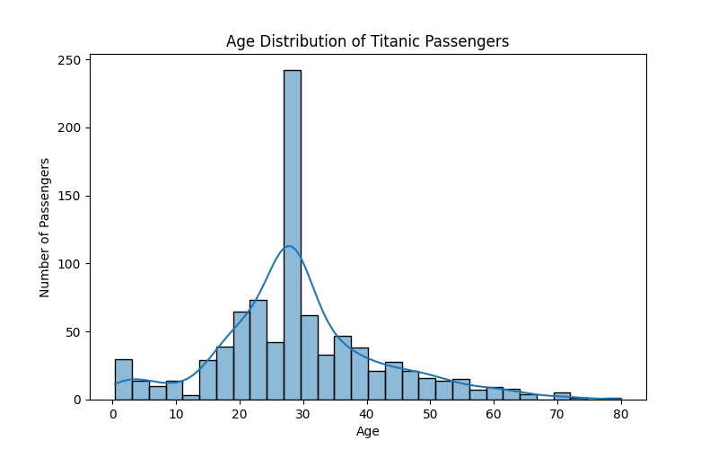

# Titanic Survival Prediction – Data Cleaning Project

## Objective

The objective of this mini project is to clean and preprocess the Titanic
dataset and perform basic data visualization.

## Tasks Completed

- Loaded the Titanic dataset using Pandas
- Identified missing values
- Handled missing Age values using the median
- Handled missing Embarked values using the mode
- Removed the Cabin column due to a large number of missing values
- Encoded the Sex column
- Encoded the Embarked column
- Visualized the age distribution
- Exported the cleaned dataset as a CSV file

## Technologies Used

- Python
- Pandas
- Matplotlib
- Seaborn

## Dataset

Titanic dataset obtained from Kaggle.

## Project Files

| File | Description |
|---|---|
| Titanic-Dataset.csv | Original Titanic dataset |
| titanic_cleaning.py | Python data-cleaning script |
| titanic_cleaned.csv | Cleaned dataset |
| age_distribution.png | Age distribution visualization |
| README.md | Project documentation |

## Data Cleaning

### Age

Missing Age values were replaced with the median age.

### Embarked

Missing Embarked values were replaced with the most frequent value.

### Cabin

The Cabin column was removed because it contained a large number
of missing values.

### Encoding

Sex was encoded as:

- Male = 0
- Female = 1

Embarked was encoded as:

- C = 0
- Q = 1
- S = 2

## Visualization

A histogram with KDE was created to visualize the age distribution
of Titanic passengers.

## Result

The Titanic dataset was cleaned, encoded, visualized, and exported
as a new CSV file suitable for further data analysis.